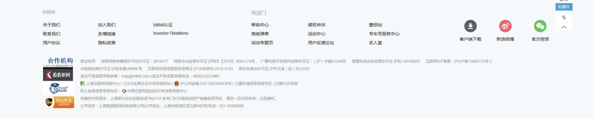
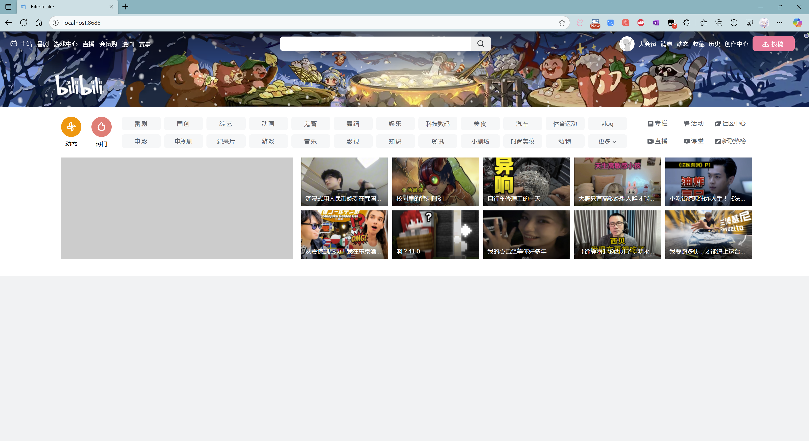

# BiliBili Like 开发说明

[toc]

## 部署

```bash
git clone git@gitee.com:Lzyspot/bilibili-like.git
cd bilibili-like
npm i
```

> 启动

```bah
npm run dev
```

> 如果需要后端
>
> ! 在本地运行后端服务需要将 `src\config\config.ts`中的 `https` 改成 `http`

```bash
npm i ts-node -g
npm run serve
```


## URL参数

##### Banner类型

```
?bannerType=interactive | animation | image | promotion
```

##### 自动切换Banner，切换间隔为12秒

```
?bannerAutoSwitchInterval=12000
```

##### 关闭自动切换banner

```
?bannerAutoSwitch=false
```

##### 关闭缓入效果

```
?easIn=false
```

##### 权重最高，如果有该参数，则其它参数全部失效

```
?banner=20260426
```


```
// 视差滚动
20201130
20210301
20210401
20230405
20230601
20230703
20230801
20230912
20231002
20231107
20231201
20231212
20240204
20240606
20240610
20241210
20250101
20250501
20250801
20250909
20260109
20260426
20220723
// 视频
20210806
20210906
20220106
20220501
20220816
黄绿合战
// 图片
2014
2015
2016
legacy
20190601
20190520
20191029
20190620
20200124
20200201
20200401
20200607
20200817
20220927
20230101
20230620
20190621
20200421
20200605
20200710
20210212
20210722
20221221
20211113
20220201
20220401
20220602
20220614
20220720
20230315
20230622
20190924
20191213
20201005
20210304
20210623
20220303
20221030
```


```ts
onMounted(() => {
  const params = new URLSearchParams(location.search)

  const bannerDate = params.get('banner') || params.get('bannerDate')
  const easeIn = params.get('easeIn')

  if (easeIn?.toLowerCase() == 'false') {
    bannerEaseIn.value = false
  } else {
    bannerEaseIn.value = true
  }

  if (bannerDate) {
    getBannerData('banner_' + bannerDate).then((mediaResources: BannerPackage) => {
      bannerData.value = mediaResources
    })
  } else {
    // banner类型
    // ?bannerType=interactive | animation | image | promotion
    let bannerType: any = params.get('bannerType')
    getBannerData(null, bannerType).then((mediaResources: BannerPackage) => {
      bannerData.value = mediaResources
    })

    // 自动切换Banner
    // ?bannerAutoSwitch!=false
    // ?bannerAutoSwitchInterval=10000
    const minInterval = 10000
    let bannerSwitchInterval = Number(params.get('bannerAutoSwitchInterval') || minInterval)

    if (params.get('bannerAutoSwitch')?.toLowerCase() != 'false' && bannerSwitchInterval) {
      // 至少10s切换一次
      bannerSwitchInterval = bannerSwitchInterval <= minInterval ? minInterval : bannerSwitchInterval

      setInterval(async () => {
        if (!document.hidden) {
          getBannerData(null, bannerType).then((mediaResources: BannerPackage) => {
            bannerData.value = mediaResources
          })
        }
      }, bannerSwitchInterval)
    }
  }
})
```


## 获取Banner数据，及实现视差滚动

**复制**并在浏览器**执行**以下文件的代码内容

```
tools\getBanner\get.dev.auto.js
```

执行完成会在**控制台**返回


秉持着 `all in one` 的原则，返回的是包含元素`加速度数据`并将其转为`base64`后的数据包，目前全部存放于以下路径

```
src\assets\bannerMediaResources
```

命名随意，通常是`mediaResources`+该banner最早的日期

> 标准可交互视差banner数据格式

```typescript
interface MediaResource {
    type: 'IMG' | 'VIDEO' | "LOGO" | "TITLE" | "CANVAS";
    src?: string;
    index?: number;
    base64?: string;
    style?: any;
    mousePos?: any;
    nStyle?: any;
    nMousePos?: any;
    offsetRate?: {
        x: number;
        y: number;
        scaleX: number;
        scaleY: number;
        rotate: number;
        blur?: number;
        opacity?: number;
    },
    init?: {
        translate: {
            x: number;
            y: number;
            z?: number;
        },
        scale: {
            x: number;
            y: number;
            z?: number;
        },
        rotate: number;
        blur?: number;
        opacity?: number;
    },
    callback?: Function;
    abs?: any;
    title?: string;
    matrix?: string;
}

interface BannerPackage {
    content: MediaResource[];
    config?: {
        style: {
            bannerHeight: number;
        }
    } | Function;
    mount?: Function;
    unmount?: Function;
    version: '1.1';
    id: string;
}
```

更新后还需在 `mediaImportSet` 中添加该脚本路径，并在 `mediaSet` 对应的对象中注册后即可使用

```
src\config\banner.ts
```


## 参考

> 参考主页面





> 参考播放页面


## 更新进度

### 2025/09/18

-  加载时
  - 随机切换支持 **视差移动** 的 `banner`
  - 由于b站的跨域策略，无法直接在前端获取b站的api，因此需要后端起到中转作用
    - 不能过于频繁地向b站请求数据，因此后端有设置请求间隔限制
    - b站的图片同样不允许跨域，因此所有的图片实际是由前端向后端发送GET请求后得到的缩放图像(206*116)
  - 使用中
    - 




